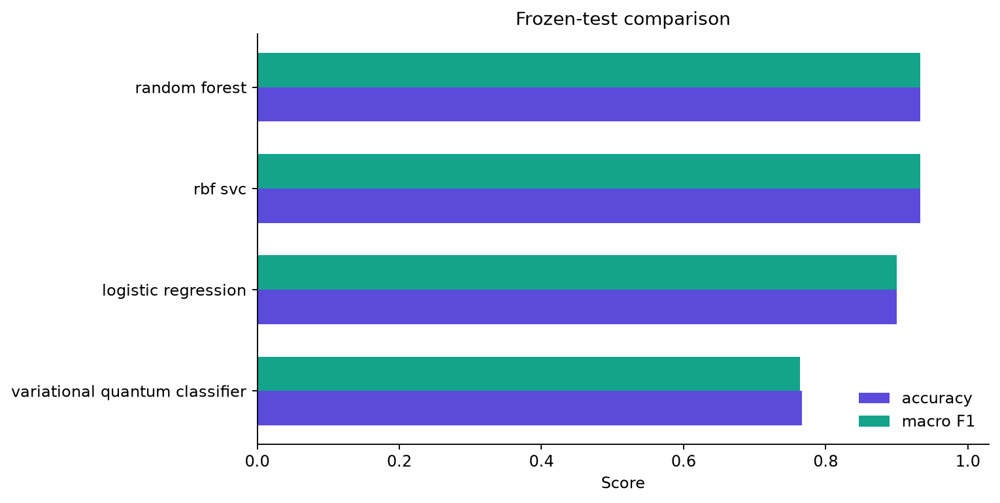
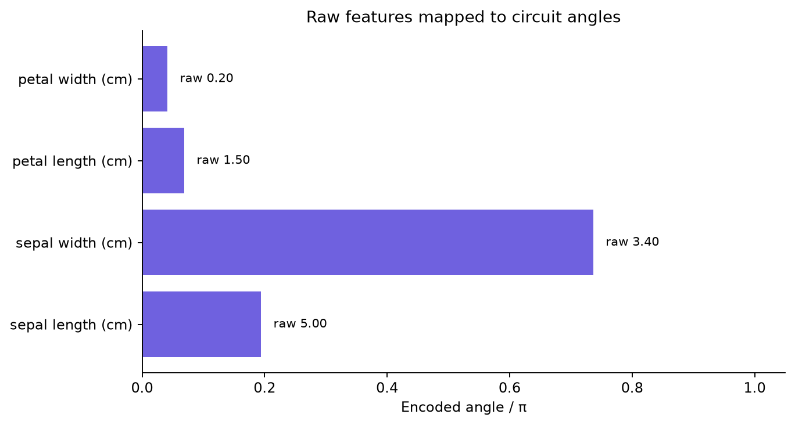
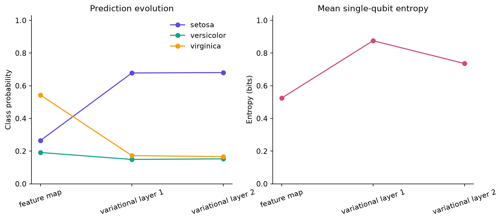
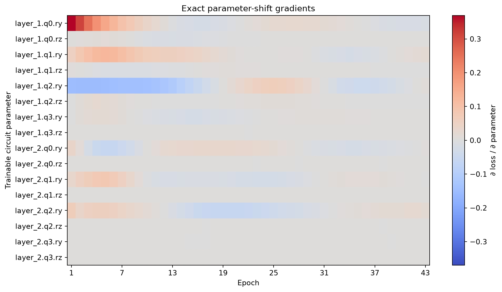
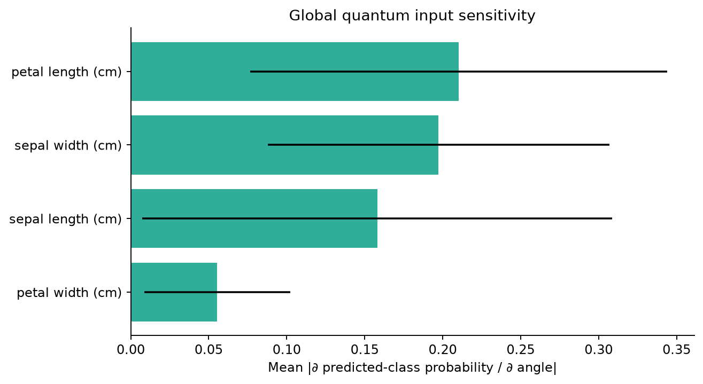
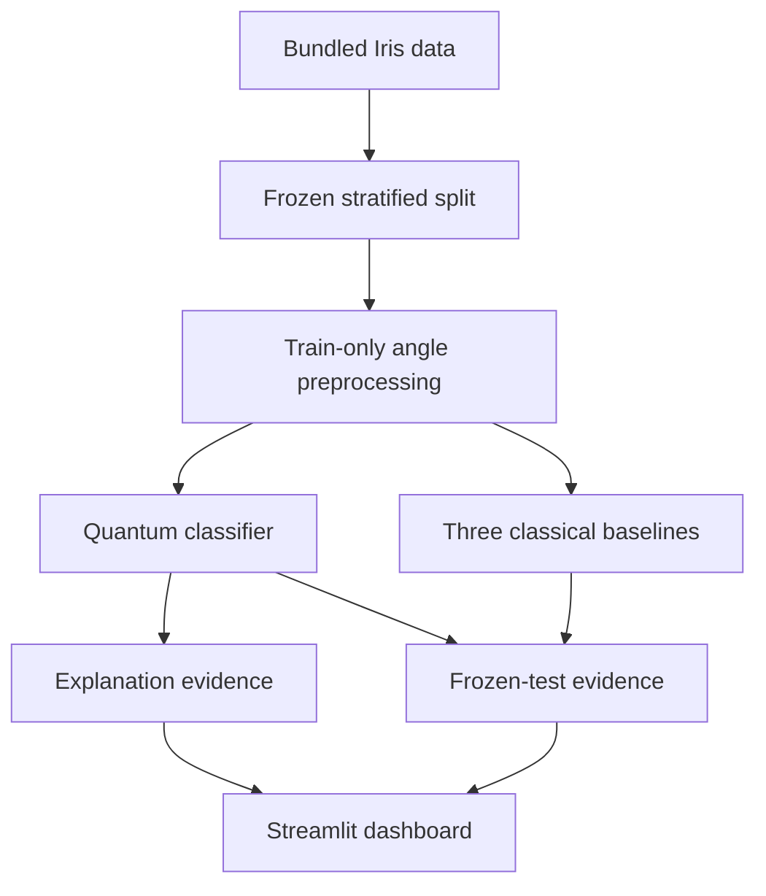

# Explainable Quantum Machine Learning Dashboard

**Created by School of AI and School of QC.**

A complete, local-first portfolio project that makes a variational quantum classifier inspectable
from end to end. It connects raw feature values to quantum angles, shows how the state and readout
change through the circuit, records exact parameter-shift gradients, and links those mechanisms to
calibrated predictions and matched classical baselines.

This repository is designed to answer a more useful question than “did the quantum model win?”:
**what did the model encode, learn, and predict—and what evidence supports each explanation?**

## Reference finding

The seed-42 reference run uses scikit-learn's bundled Iris dataset and one frozen 60/20/20 split.
The quantum classifier reached **0.767 accuracy and 0.764 macro F1**. Random forest and RBF SVC each
reached **0.933 accuracy and 0.933 macro F1**. The quantum model trailed the strongest classical
baseline by **0.169 macro F1**.

That result is reported as measured. This small, noiseless statevector experiment is an
explainability study—not evidence of quantum advantage, hardware speedup, or production readiness.



## What the dashboard explains

- **Feature encoding** — raw centimeters, train-only standardized values, angles in `[0, π]`, and
  post-encoding single-qubit Bloch components.
- **Circuit behavior** — exact basis probabilities, Pauli-Z readouts, class probabilities, and mean
  single-qubit entropy after the feature map and each trainable layer.
- **Optimization** — train/validation learning curves, every per-epoch parameter-shift derivative,
  gradient norms, and the validation-selected checkpoint.
- **Predictions** — four-model metrics, confusion matrices, confidence calibration, local input
  sensitivity, a two-feature decision slice, and the nearest single-feature prediction flip found
  on a bounded grid.









## Architecture



The trained quantum path has four qubits, two variational layers, and 16 trainable angles. A compact
NumPy statevector engine exposes intermediate states and trains quickly. Qiskit independently builds
the same circuit; three reference samples achieved state fidelities above
`0.999999999999998`, providing an implementation parity check.

## Quantum model

For feature (i), the preprocessing pipeline maps the raw input to (x_i \in [0,\pi]). The feature
map applies:

1. (H_i)
2. (R_Y(x_i))
3. (R_Z(x_i/2))
4. Adjacent (R_{ZZ}\left(\frac{(\pi-x_i)(\pi-x_j)}{2\pi}\right)) gates

Each variational layer applies trainable `RY` and `RZ` rotations to every qubit, then a four-edge
`CZ` ring. Exact Pauli-Z expectations on qubits 0, 1, and 2 become three scaled softmax logits.

For every trainable rotation angle, the project evaluates the exact two-circuit parameter-shift
derivative:

\[
\frac{\partial \langle Z \rangle}{\partial \theta}
= \frac{\langle Z \rangle_{\theta+\pi/2}-\langle Z \rangle_{\theta-\pi/2}}{2}.
\]

Full-batch Adam minimizes cross-entropy. Validation-loss early stopping selected epoch 33 and
stopped at epoch 43 in the reference run.

## Classical controls

The project fits three fixed-hyperparameter controls on the same 90 training rows and the same
train-fitted four-angle representation:

- Multinomial logistic regression
- RBF support-vector classifier
- 300-tree random forest

No model sees test labels during training or checkpoint selection. The comparison includes accuracy,
balanced accuracy, macro precision/recall/F1, one-vs-rest ROC AUC, log loss, multiclass Brier score,
top-label expected calibration error, fit time, and inference time.

## Quick start

Python 3.11 or 3.12 is recommended. No API key, paid service, cloud account, or dataset download is
required.

```bash
python -m venv .venv
source .venv/bin/activate
python -m pip install --upgrade pip
python -m pip install -e ".[dev,notebook]"
```

Launch the dashboard:

```bash
streamlit run app.py
```

Run a new audited experiment:

```bash
xqml-dashboard run \
  --config configs/default.json \
  --output artifacts/my-run
```

Verify the checked-in reference bundle:

```bash
xqml-dashboard verify --run examples/reference-run
```

Run all quality gates:

```bash
make quality
```

## Saved inference

Export a valid input file:

```bash
python scripts/export_dataset.py --output data/iris.csv
```

Classify it with any saved model:

```bash
xqml-dashboard predict \
  --run examples/reference-run \
  --input data/iris.csv \
  --output artifacts/predictions.csv \
  --model variational_quantum_classifier
```

Required columns are `sepal length (cm)`, `sepal width (cm)`, `petal length (cm)`, and
`petal width (cm)`. Extra columns are ignored, non-finite values are rejected, and dashboard uploads
are capped at 10,000 rows.

The JSON quantum model is safe to inspect. The saved preprocessor and classical estimators use
joblib, which is pickle-based; only load artifacts created by this repository or another trusted
source.

## Explanation semantics

The dashboard keeps distinct quantities distinct:

- A **Bloch component** is a local quantum-state statistic after encoding.
- **Single-qubit entropy** describes local mixedness/entanglement in a pure global state; it is not
  feature importance.
- A **parameter gradient** explains the local loss landscape around one training epoch.
- **Input saliency** is a central-difference derivative of the predicted-class probability with
  respect to an encoded angle. It is local and non-causal.
- A **counterfactual** is the closest grid point that flips the model by changing one feature. It is
  a bounded model probe, not advice and not proof that the feature causes the class.
- A **decision surface** is a two-feature slice with the other angles held at their training median;
  it is not the full four-dimensional boundary.

See [docs/EXPLAINABILITY.md](docs/EXPLAINABILITY.md) for formulas and interpretation rules.

## Reproducibility bundle

`examples/reference-run/` contains the complete seed-locked evidence trail:

- Exact configuration, environment versions, dataset metadata, and frozen row assignments
- Raw and angle-encoded dataset snapshots
- Learning history and all 688 recorded parameter gradients
- Saved quantum model, preprocessor, and classical estimators
- Test probabilities, calibration bins, confusion matrices, and summary metrics
- Reference encoding, circuit trace, basis probabilities, saliency, and counterfactual
- Text-rendered Qiskit circuit, parity diagnostics, report, plots, and SHA-256 artifact manifest

Run metadata includes timings, which naturally vary by machine; scores, splits, model parameters,
and explanations are seed-locked.

## Project layout

```text
.
├── app.py                         Streamlit dashboard
├── configs/default.json           Reproducible protocol
├── docs/                           Design, evaluation, and governance notes
├── examples/reference-run/         Checked-in evidence and saved models
├── notebooks/quickstart.ipynb      Executable guided analysis
├── scripts/                        Dataset export and inference wrappers
├── src/explainable_qml_dashboard/  Tested Python package
└── tests/                           Unit, parity, gradient, and integration checks
```

## Documentation

- [Architecture](docs/ARCHITECTURE.md)
- [Dataset and leakage controls](docs/DATASET.md)
- [Explainability methods](docs/EXPLAINABILITY.md)
- [Evaluation protocol](docs/EVALUATION.md)
- [Experiment guide](docs/EXPERIMENT-GUIDE.md)
- [Model card](docs/MODEL-CARD.md)
- [Responsible use](docs/RESPONSIBLE-USE.md)
- [Reference results](docs/RESULTS.md)
- [Verification record](docs/VERIFICATION.md)
- [Portfolio and demo guide](docs/PORTFOLIO-GUIDE.md)
- [100-point self-assessment](docs/SELF-ASSESSMENT.md)
- [GitHub upload guide](docs/GITHUB-UPLOAD.md)

## Tests and acceptance criteria

The suite covers configuration validation, data leakage guards, deterministic splits, simulator
normalization, NumPy/Qiskit state fidelity, gate counts, entropy bounds, exact gradient agreement,
training records, saved-model round trips, metric calculations, explanations, upload schema safety,
artifact integrity, and end-to-end inference.

A release is accepted only when:

- `ruff check .` and `ruff format --check .` pass.
- `pytest` passes all tests.
- `python -m build` creates both source and wheel distributions.
- The quickstart notebook executes from top to bottom.
- A clean extracted archive reproduces the checks.
- Every reference plot is visually inspected and the artifact manifest verifies.

## Limitations

- Iris is tiny, clean, balanced, and not representative of production data.
- One split and one seed cannot characterize model variance.
- Exact statevector simulation omits shot noise, device noise, transpilation, queueing, and hardware
  latency.
- The QVC is intentionally compact and receives no architecture search or broad hyperparameter tune.
- Gradient and saliency explanations can be unstable away from the sampled point.
- The counterfactual search changes only one feature and may create botanically implausible samples.
- Higher test accuracy from a simulator would still not, by itself, establish quantum advantage.

## Technical references

- [scikit-learn Iris loader](https://scikit-learn.org/stable/modules/generated/sklearn.datasets.load_iris.html)
- [IBM Quantum `Statevector` documentation](https://qiskit.qotlabs.org/docs/api/qiskit/qiskit.quantum_info.Statevector)
- [Mitarai et al., *Quantum Circuit Learning*](https://doi.org/10.1103/PhysRevA.98.032309)
- [Wierichs et al., *General parameter-shift rules for quantum gradients*](https://doi.org/10.22331/q-2022-03-30-677)
- [Heese et al., *Explaining Quantum Circuits with Shapley Values*](https://arxiv.org/abs/2301.09138)

## License and contribution

Released under the [MIT License](LICENSE). See [CONTRIBUTING.md](CONTRIBUTING.md),
[SECURITY.md](SECURITY.md), and the [Code of Conduct](CODE_OF_CONDUCT.md) before contributing.

---

**Created by School of AI and School of QC.**
