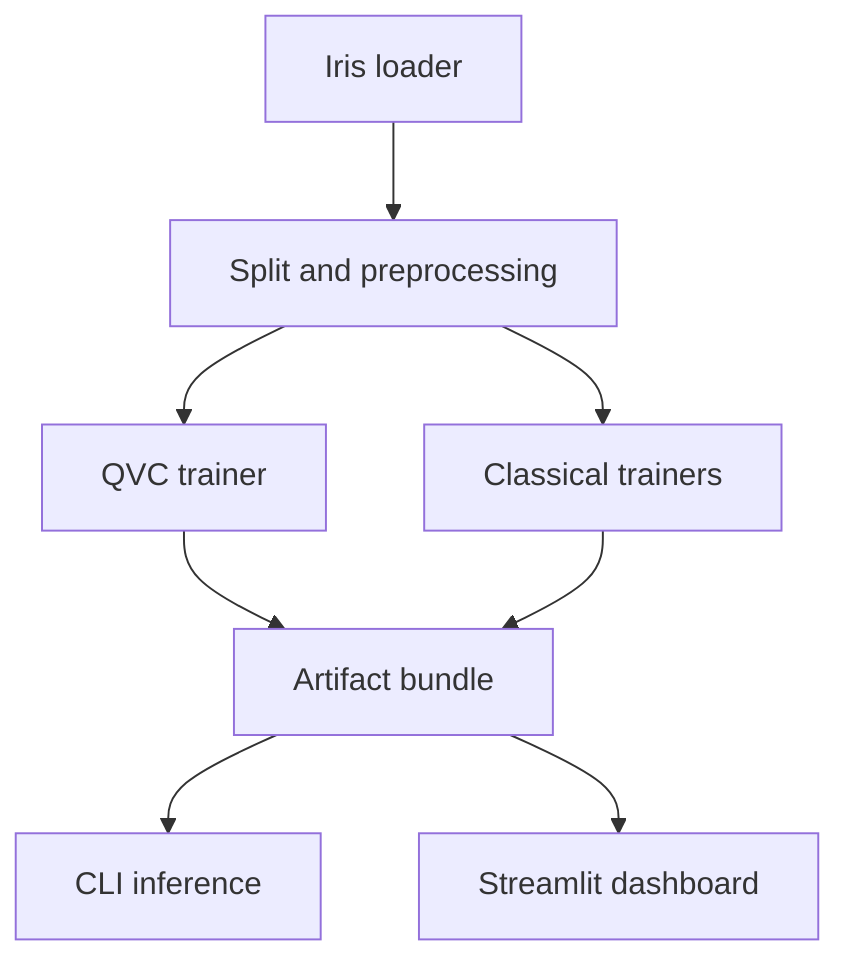

# Architecture

## Design goals

The system is built for inspectability, reproducibility, and honest comparison. The quantum model is
small enough to simulate exactly, every transformation is serializable, and the dashboard consumes
the same artifacts used by the CLI and tests.

## Package boundaries

- `data.py` loads Iris, creates frozen stratified indices, and fits the two-stage angle preprocessor.
- `quantum.py` owns the transparent statevector engine, quantum diagnostics, and the independent
  Qiskit circuit builder.
- `qvc.py` turns three exact Z expectations into class probabilities and trains 16 angles with
  exact parameter-shift gradients.
- `evaluation.py` fits classical controls and computes comparable discrimination, probability, and
  timing metrics.
- `explain.py` produces encoding, layer-trace, saliency, and counterfactual evidence.
- `experiment.py` freezes the protocol and writes the complete audit bundle.
- `inference.py` validates input schema and runs saved models.
- `visualization.py` renders deterministic report figures.
- `app.py` is a thin interactive client over saved artifacts and package functions.

## Quantum execution path

The NumPy simulator stores amplitudes in Qiskit's little-endian basis order. It applies in-place
single-qubit rotations and diagonal two-qubit operations to batches of 16-amplitude states. The
Qiskit builder repeats the same operations independently. Tests compare pure-state fidelity rather
than element-wise equality so global phase cannot create a false mismatch.

The exact simulator is intentional: intermediate states, basis probabilities, reduced states, and
deterministic gradients are all available without measurement noise. It is not a hardware proxy.

## Artifact contract

Every run includes human-readable JSON/CSV/text evidence, PNG plots, a JSON quantum model, trusted
local joblib files, and an `artifact_manifest.json` containing path, byte count, and SHA-256 digest.
The dashboard never silently retrains when it opens; it loads the checked-in reference bundle.

## Dependency direction

Core numerical code does not import Streamlit. The CLI and dashboard depend on the package; the
package does not depend on either interface. This keeps tests fast and makes future API or batch
interfaces straightforward.

Created by School of AI and School of QC.

