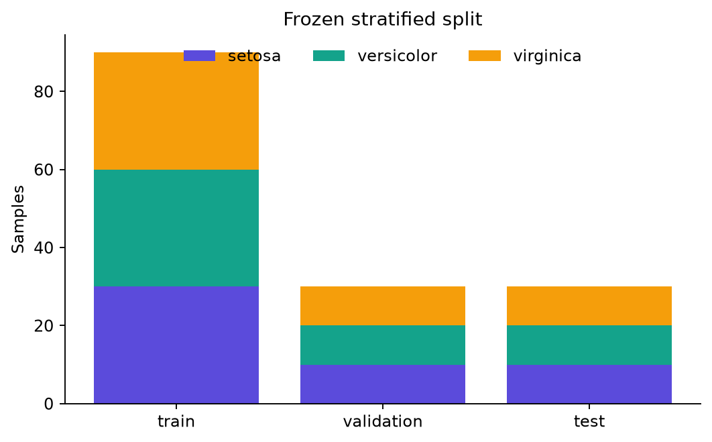

# Dataset and leakage controls

## Source

The project uses Fisher's Iris classification dataset bundled with scikit-learn. It contains 150
rows, four numeric flower measurements, and three balanced species labels:

- 50 setosa
- 50 versicolor
- 50 virginica

The loader is packaged with scikit-learn, so execution requires no download. The reference bundle
includes the resolved dataset snapshot used in the run.

## Frozen split

Seed 42 produces a stratified partition with:

- 90 training rows
- 30 validation rows
- 30 test rows

The row-level assignment is stored in `examples/reference-run/fixed_split.csv`.

## Preprocessing

Only the 90 training rows fit the pipeline:

1. `StandardScaler` centers and scales each raw feature.
2. `MinMaxScaler(feature_range=(0, π), clip=True)` maps the standardized training range to a valid
   rotation-angle interval.

Validation, test, dashboard, and CSV-inference rows use those frozen statistics. Out-of-range values
are clipped at the angle boundary. The fitted means, scales, extrema, and angle-map coefficients are
written to `preprocessing.json`.

## Leakage safeguards

- Split indices are created before preprocessing.
- Fit methods receive training rows only.
- Quantum early stopping sees validation loss, never test loss.
- Classical hyperparameters are fixed rather than test-tuned.
- The test partition is used once for final model comparison and explanation aggregation.
- Tests assert split disjointness, completeness, class counts, inverse transforms, and angle bounds.

## Appropriate use

Iris is suitable for teaching mechanics, testing contracts, and producing quick reproducible
experiments. It is not suitable for claims about real-world model robustness, scaling, economic
value, or quantum advantage.

Created by School of AI and School of QC.

