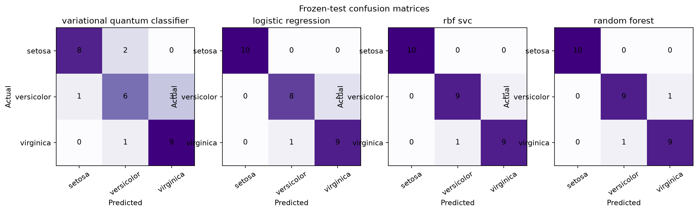
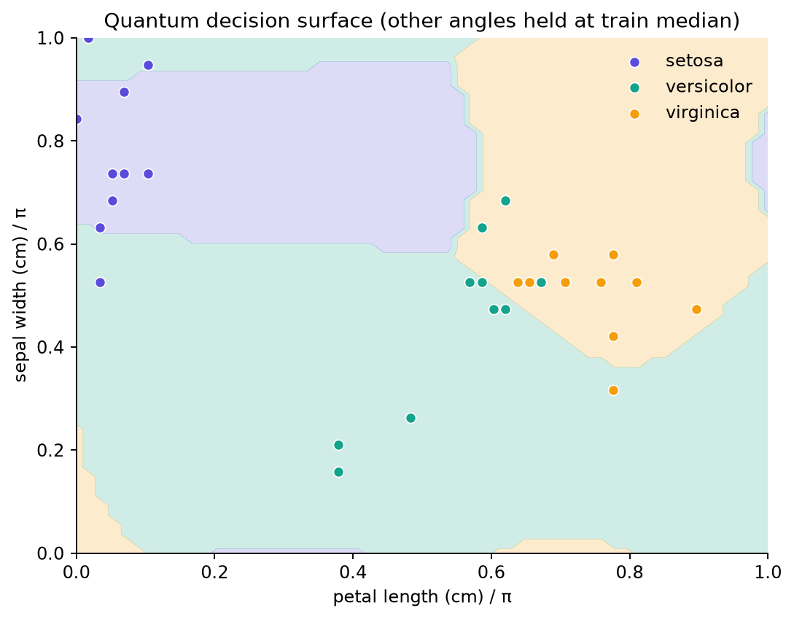

# Reference results

## Run identity

- Version: 1.0.0
- Date: 2026-09-22
- Seed: 42
- Split: 90 train, 30 validation, 30 test
- Quantum architecture: four qubits, two layers, 16 trainable angles
- Execution: exact noiseless local statevector
- Selection: minimum validation loss, epoch 33; stopped at epoch 43

## Frozen-test model comparison

- **Random forest** — accuracy 0.933, macro F1 0.933, ROC AUC 0.987, log loss 0.216,
  Brier score 0.104, ECE 0.071.
- **RBF SVC** — accuracy 0.933, macro F1 0.933, ROC AUC 0.997, log loss 0.147,
  Brier score 0.069, ECE 0.116.
- **Logistic regression** — accuracy 0.900, macro F1 0.900, ROC AUC 0.992,
  log loss 0.216, Brier score 0.116, ECE 0.126.
- **Variational quantum classifier** — accuracy 0.767, macro F1 0.764, ROC AUC 0.892,
  log loss 0.716, Brier score 0.418, ECE 0.313.

The quantum-minus-best-classical macro-F1 difference is **−0.169**. The result does not support a
quantum-advantage claim.

## Error behavior

The quantum model correctly classified all 10 virginica test rows, classified 8 of 10 setosa rows,
and classified 6 of 10 versicolor rows. Its six errors concentrated around setosa/versicolor and
versicolor/virginica boundaries. The classical models made two or three errors each.

## Explanation findings

Across the 30 test rows, mean absolute quantum probability sensitivity per encoded radian ranked:

1. Petal length: 0.210
2. Sepal width: 0.197
3. Sepal length: 0.158
4. Petal width: 0.055

These values describe the local slopes of this exact saved circuit; they are not botanical or causal
feature importances.

For reference dataset row 7, the feature map initially favored virginica, while the first trainable
layer shifted the prediction strongly toward setosa. Mean single-qubit entropy rose from roughly
0.52 after encoding to 0.87 after layer one, then fell to about 0.74 after layer two.

The nearest one-feature grid flip for row 7 changed sepal length from 5.00 cm to 5.92 cm, moving the
model from setosa to versicolor at low confidence (0.343). This is an off-manifold model probe, not a
plausible intervention.

## Numerical verification

The NumPy/Qiskit state fidelities for three frozen test samples were all above
`0.999999999999998`. Maximum observed infidelity was `1.55e-15`. The reference state norm differed
from one only at floating-point precision.

## Timing caveat

The reference QVC fit took about 80 seconds in the final packaging environment; classical fits took
well under one second. These are implementation observations, not a resource-matched benchmark. The
QVC performs many exact shifted simulations and no quantum hardware was used.

Created by School of AI and School of QC.
